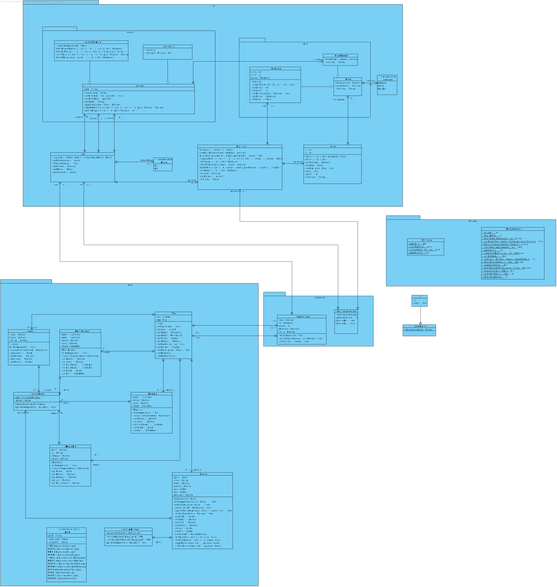

# Zen l'inité

Dans le cadre d'un projet, j'avais pour but de recréer le jeu de plateau Zen l'inité [voir règles](./data/regle.pdf)
ir téléchargé le jeu Zen l'initié! 

Pour faciliter la compréhension des consignes voici l'arborescence semi-développée de mon projet :

```
|-- ws
|   `-- build.xml
|-- src
|   |-- test
|   |-- controleur
|   |-- utilitaire
|   |-- jeu
|   |-- view
|   `-- ZenLInitie.java
|-- dossierJar
|   `-- Zen-l-initie.jar
|-- javadoc
|-- reportTest
|-- data
|   |-- regle.pdf
|   |-- sound
|   `-- img
|-- lib
|   |-- junit-4.12.jar
|   `-- hamcrest-core-1.3.jar
|-- save
|   |-- win.ze
|   `-- contreIA.ze
```

## Description

Mon programme a été construit sous le modèle MVC, il fallait donc, dans la partie modèle aucune
interaction avec l’utilisateur. Pour respecter la programmation objet, j’ai divisé chaque élément en
classe. Même si on aurait pu se passer de certains objets comme par exemple Case, mais cela facilite
la compréhension du code et la programmation.
Lorsqu’il y a une interaction avec l’utilisateur c’est la vue qui rentre en jeu, le contrôleur prend la
réponse du joueur, met à jour le model et donc modifie la vue en fonction (principe MVC). Pour faciliter
les choses j’ai décidé d’avoir de l’interaction avec une seule classe de la vue et un seul contrôleur. La
classe de la vue a en attribut tous les autres membres de son package. Ce qui facilite le code au niveau
du contrôleur. Etant donné le nombre limité de boutons, tous les éléments sont gérés par le même
contrôleur. J’ai modélisé le plateau par des boutons, ce qui peut être lourd au niveau du code et de la
boucle principale du jeu, mais très intéressant graphiquement. De même pour le mode console, il y a
un seul contrôleur et une seule classe de vue. J’ai choisi de mettre toutes ces méthodes en « static »
car ce n’est que de l’affichage, ce n’est pas un réellement un objet à proprement parler.
Pour la construction des classes, j’ai essayé d’avoir le moins de redondances d’information, c’est-à-
dire que la classe Pion ou encore Case n’a pas de coordonnées x,y car ceux-ci sont retrouvables dans
la classe Plateau. Cependant cela peut au bout d’un moment affecter les performances du programme
(à force de parcourir un tableau à 2 dimensions).
Pour la partie vérification des coordonnées tout se joue dans les classes Joueur, pour faciliter le code
de la classe Plateau. Pour la classe du joueur IA, j’ai décidé de calculer les 8 positions possibles à partir
d’un pion et de choisir aléatoirement une de ces 8 positions. Les positions se calculent de la manière
suivante : Il y d’abord recherche d’un pion, puis à partir de ce pion on calcule le nombre de pions qui
sont sur les 8 lignes. Ensuite on regarde parmi les déplacements obtenus lesquels sont valides (ne
dépassent pas du tableau) et sur lesquels il n’y a pas de pions adverses. Dans les positions restantes,
nous en tirons une aléatoirement.
Le joueur IA n’a donc aucune réelle stratégie et se déplace sur de l’aléatoire. Je n’ai pas voulu donner
de réelle stratégie à l’IA parce que je n’en ai pas les compétences et que ça aurait été trop de temps
investi pour peu de résultat.
J’aurais pu aussi calculer les mouvements possibles pour le joueur humain, mais ça ne lui indiquait pas
pourquoi un mouvement n’était pas possible, en lui notifiant pourquoi cela aide dans une
compréhension des règles du jeu. Ceci peut parfois rendre le programme assez lourd en termes de
calcul. En effet, on regarde si les règles de déplacement sont valides une par une. Toute d’abord, si le
déplacement est bien en ligne droite, puis s’il y a le bon nombre de case, et enfin s’il n’y a pas d’obstacle
sur le chemin. Le plus compliqué dans ce système c’est de savoir le nombre de case valide dans les
diagonales. Pour cela, il faut arriver à descendre le plateau jusqu’à atteindre une bordure, puis tout
remonter jusqu’à une autre bordure. Ceci n’est pas très optimisé.
À la vue du temps qu’il me restait sur les derniers jours du projet, j’ai quand même implémenté cette
fonctionnalité pour aider les joueurs en grande difficulté sur la compréhension des règles.
Pour la recherche de victoire, je suis parti sur une méthode récursive. On lui donne une liste de pions
en entrée et un point de départ (le premier pion trouvé) et ensuite elle va parcourir toutes les cases
8connectées (8 aux alentours d’une case) où un pion de même couleur s’y trouve. En faisant de la
récursivité, on est sûr de parcourir toutes les branches possibles de la chaine. Si à la fin, la liste de pion
n’est pas vide ça veut dire que la chaine n’est pas complète.
## Diagramme


## Lancement

Il est très important de vous placer dans le répertoire "ws", sinon les commandes suivantes ne marcheront pas ! 
Le .jar ne dépend pas de fichier externe mais si vous le déplacer il faut adapter les commandes suivantes. 

Pour lancer le jeu : 2 moyens possibles 
- avec la commande :
 ```sh
 java -jar ../dossierJar/Zen-l-initié.jar
 ```
- ou si ant est installé sur votre pc : 
``` 
ant runJar
```

Ensuite, il suffit de suivre les instructions du programme. 
ATTENTION : si vous lancez avec "ant runJar", vous ne voyez pas ce que vous écrivez dans la console mais vous écrivez bien ! 

Le répertoire "javadoc" contient toute la documentation du projet, le répertoire "reportTest" contient quant à lui les résultats (en HTML) des tests unitaires effectués. 

Pour toutes informations sur le build.xml vous pouvez rentrer la commande :`ant -projecthelp` . Vous aurez accès à toutes les targets ainsi qu'à leur description. 

Si vous voulez tester la sauvegarde, il y a déjà 2 parties sauvegardées à votre disposition (les .ze dans /save). 

Pour en apprendre un peu plus sur le fonctionnement du logiciel ou des règles, je vous invite à consulter /data/regle.pdf. 

Le jeu est fonctionnel sur console ou en mode graphique.

Amusez-vous bien !  
